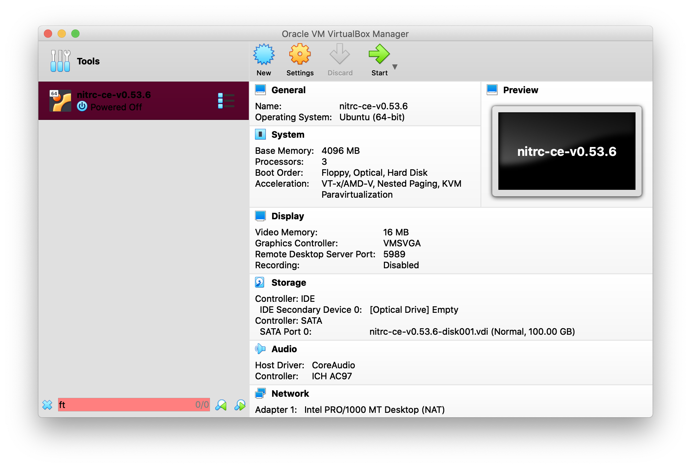

This page will tell you how to access your personal virtual (VM) to run these lessons. The virtual machine is essentially a "computer within a computer". For this workshop, we have created virtual machines that are running the [NITRC Computational Environment](https://www.nitrc.org/projects/nitrc_es/), which has all the neuroimaging analysis software needed to run the lesson pre-installed and ready to go. 

There are two ways to run this VM: 
1. **Cloud VM** Most of you will be working with one that is located in the cloud, so all you will need to use this VM is a modern web browser. 
1. **Local VM - This is the preferred option if you have a suitable laptop** You will use your personal laptop to run the VM. This method does not require a strong internet connection, but it does require some software to be downloaded ahead of the workshop, as well as a fair amount of storage on your hard drive. 

### Cloud based instructions
You will have been supplied a piece of paper with two pieces of information: an IP address, which is the location of your personal VM on the internet, and an instance ID, which begins with the lowercase letter "i" serves as the password for the VM. 
1. Open up a window on your preferred browser and enter the IP address you have been supplied for this course. For example if the IP address is 1.2.3.4, you should point your browser to http://1.2.3.4/. 
1. If successful, you should see a web page that looks like this:

1. Under the section marked Amazon Instance ID, please enter the instance ID that you have been provided. If it additionally asks you for an email address, you can either put the organizers address or your own. 
1. Click the **Submit** button
1. A new page will open up, and there will be a button that says **Open Desktop**. 

1. Click on that button and, this will show you the desktop of the virtual machine as if you were working right in front of it. If you get a black screen, please go back to the previous webpage and select **Restart VNC client**. The webpage will inform you that it has restarted successfully. Then you can try clicking on **Open Desktop** again. 

1. Your browser may ask you for permission to access your keyboard and mouse. Please allow this. 

### Local VM Instructions 
Unlike the VM's on the cloud, if you download and run the VM from your computer, it will be your computer doing all the work visualizing and processing the data as part of the lesson. That means it will take a lot of your computing power, memory and disk space when it is running. On the other hand, it will not require a robust internet connection.

**If you will run the VM locally, we highly recommend you do these steps before the workshop!**

Here are the steps for setting it up:
1. [Download](https://www.oracle.com/uk/virtualization/technologies/vm/downloads/virtualbox-downloads.html) the software VirtualBox. This is a program that is capable of running the virtual machine on your computer. Click on the appropriate installer for your operating system and follow the instructions for installation.
1. After installation is complete, launch the VirtualBox application. You should see the following window pop up. 

1. Next [download](https://liveuclac-my.sharepoint.com/:u:/g/personal/ucacdmc_ucl_ac_uk/EVSDW2mQ33ZCtpUxQ3XlsdoB6p1jj5C_Z0WZvdaoQT-92A?e=JQFDhV) the virtual machine we have created for the course. This file represents the computer that VirtualBox will start up within your machine. This file is 28GB in size, so it will take a while to download. You will need a password to download this file. Please contact the [course organizer](./index.md#organizing-committee) to arrange.
1. Once the file is downloaded, click on the Import button in the top part of the window (yellow U-turn icon). It will open up the import window. In the second field, select the file that you have just downloaded. Then press the continue button.

1. The next window will summarize the VM. Accept these settings by clicking on continue.

1. This will take a few minutes to import. 
1. After the import has completed,  you will see the VM available on the left hand side of the window. Click on the VM and then press the Start icon on the top part of the window (green arrow)

1. The Virtual Machine will start up and present you with a window with a desktop that looks similar to the one on the cloud and you can start to do your work.

