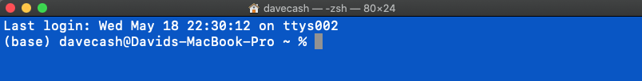
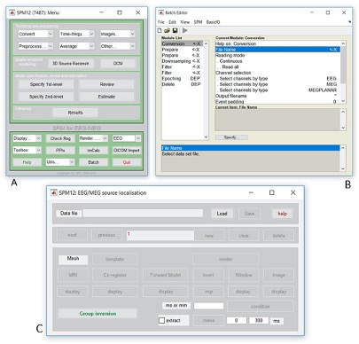
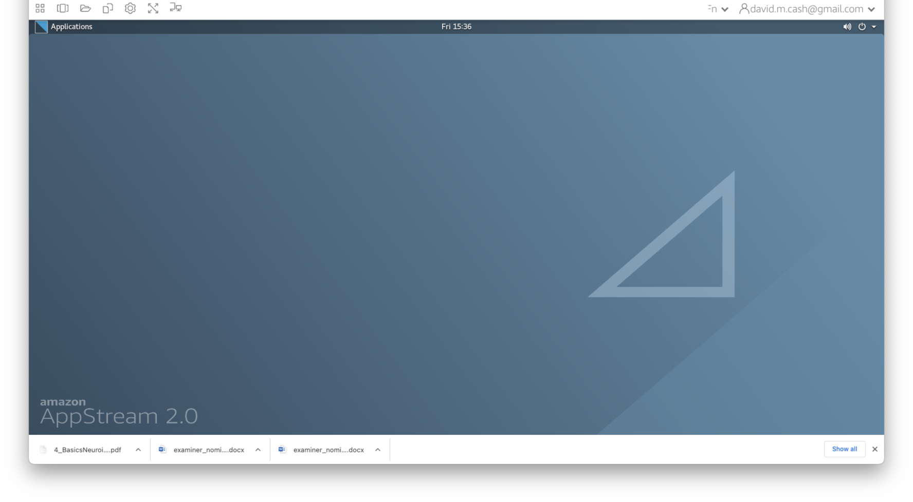

## Why use the command line?
In order to get started with neuroimaging analysis, it is really helpful to first understand how to interact with a computer on the command line called the shell. At first look, it's pretty bare bones and minimalist. How can this simple way of interacting with a computer be so useful?



Nowadays, we usually interact with a computer using a *Graphical User Interface* or a GUI. These include programs like Word, Chrome, iTunes which allow you to interact using your mouse to press buttons, select options, move sliders, change values, etc. It provides a simple, intuitive way for us to access the essential functionality that we need from these programs. Some neuroimaging analysis software does comes with a GUI, like this one from the Statistical Parametric Mapping (SPM) toolbox, a popular MATLAB based package.



### Benefits of the command line
While GUIs are often the best way to interact with your computer, using the command line for neuroimaging analysis is tremendously powerful for many reasons:
1. **Automation** GUIs typically will wait until you tell them what to do. When you go home at night, it won't do anything because it has no instructions! You can setup the command line to automate some tasks so that it works late in the night while you are sleeping. 
1. **Scalability** Working with a GUI often means a lot of mouse moves and clicks. For a small handful of imaging sessions, this is a fine way to work, but what if your research project has *hundreds* of datasets to process. It's far more likely that an error could occur or a dataset is missed. While you go through this lesson, count the number of mouse clicks it takes you to do a task and think about how that would scale to your project. When you run on the command line it has all of the information it needs, so no interaction is needed, saving a lot of your time.
1. **Control** With GUIs, you often only have access to the options that are presented...but that might not be all of them, and they might restrict you from what you want to do. With the command line, you may need to do some investigation, but you have total control over how the task is run. 
1. **Interoperability** You may find that you want to take results from one program and feed them into another and then another. With GUI's this often means saving or exporting the results, then opening up the other program and importing them. The command line often allows you to pieces these steps together in one set of instructions.  

## Getting started
In this section, we are going to go through some basic steps of working with the command line. Make sure you are able to connect to your working environment by following the directions in the [Connecting](./connecting.md) section of this website. As a reminder, you should have a desktop on your virtual machine that looks something like this:

At the bottom of the the screen, you will see a taskbar. One of the icons is a black box with a white dollar sign in it. That will launch the shell (Terminal Emulator) to give you access to the command line. Click on that to launch the terminal.


## Navigating the file structure
The desktop of your virtual machine will have a black window with green text in it. This is the shell. We will enter some commands and see what the responses are.

1. The first thing we are going to do is figure out where we are. We do that using the command `pwd` which stands for *present working directory*. Type it in the command line and see what the response is:
    ```shell
    pwd
    ```
    The response you should have gotten is `/home/ubuntu`. This is your *home directory*
1. Next we are going to see what items are contained in this directory. To do that, simply type `ls` and it should show you all the files.
    ```shell
    ls
    ``` 
    You will notice that some of the entries are different colors. The colors indicate whether the entries are files or directories. They also can indicate if these files or directories have special properties. 
1. If we want more information about these files and directories, then we can use the same command with a *command line option* `-l` to tell the computer to list the files in a long format
    ```shell
    ls -l
    ```
    This now gives a lot more information about who owns the file (3rd and 4th column), what permissions they have to read, write or run (execute) the file (first column),  and when it was modified (6th column). 

    If you want to list the contents of a different directory, just put it after the `ls -l`
    ```shell
    ls -l data
    ```

1. The `data` directory in your home directory is where you will be storing your work. So let us move into that directory using the `cd` or *change directory* command:
    ```
    cd data
    ```
    Now type the command `pwd` again. Has the result changed?
    
    What happens when we list the contents of this directory?
    ```shell
    ls -l
    ```
    You don't get anything back, as this directory currently is empty!
1. Inside the data directory, let's create a new directory that we will call `mywork`. We do that using a command called `mkdir`,
    ```shell
    mkdir mywork
    ```
    Run the `ls` command again to see how the contents have now changed to show your new directory.

### Helpful hints
* **Feeling lost?** You can always get back to your home directory simply by typing `cd` without any arguments or by using the tilde symbol, which is the shortcut for home.
    ```shell
    cd
    cd ~
    ```
* **Help me!** If you want to know more about a command, just type `man` in front of it to get the *manual entry*.
    ```shell
    man ls
    man find
    man more
    man less
    ```
* **Previous commands** If you want to see a list of commands that you have run, you can type in the `history` command. You can also scroll through previous commands by tapping the up and down arrow keys and then hit Return when you found the command you want to run again.
* **Paths** Locations in the file system, whether they are files or directories, are known as paths. Paths can be referred to in *absolute* terms (like a postcode or latitude and longitude) or *relative* terms (like directions to your work from home). In some cases it is more convenient to use absolute paths, and in others, relative paths are nicer. Absolute paths always begin with a `/` character. From your home directory, the following two commands do the exact same thing.
```shell
ls bin
ls /home/ubuntu/bin
```

## Processing files
In this section, we will go over how to copy and view the contents of the files. There is some helpful information about one of the images in our Structural MRI lesson that we want to look at in more detail. 
1. Let's copy it over from the directory it is currently located into our new `mywork` directory. We do this using the `cp` or *copy* command. We first specify the *source*, or the file/directory that we want to copy (`data/StructuralMRI/sub-OAS_30003_T1w.json`), and then we specify the destination path where we want to make the copy (`data/mywork`). **Before we do this command, let's make sure we are back in the home directory first** 
    ```shell
    # Go back to the home directory
    cd
    # Copy the file.
    cp data/StructuralMRI/sub-OAS_30003_T1w.json data/mywork
    ```
1. Now let us confirm that the copy of the file is where we expect it to be:  
    ```shell
    ls data/mywork/
    ```
1. Finally, let's look at the contents of the file. We can do that with the command `cat` which concatenates and prints files.
    ```shell
    cat data/mywork/sub-OAS_30003_T1w.json 
    ``` 
1. That just flew off the screen didn't it? If we want to have a bit more control over how we view larger files, then we can use the `more` command. Press the return key to scroll one line at a time or the space bar to scroll a whole screen page at a time.
    ```shell
    more data/mywork/sub-OAS_30003_T1w.json 
    ```
1. We no longer need that file anymore (remember it is just a copy), so we can remove files by using the `rm` command, but **BE CAREFUL** and check the command twice before executing the command, as this cannot be undone! Watch out for any spaces or any special characters like the `*` and `?` as they mean something special in the shell. 
    ```shell
    rm data/mywork/sub-OAS_30003_T1w.json 
    ```

## Next Steps
You have completed the command line function. Now let's use what we learned to start looking at images!

## Further reading
If you want to find out more how to use the command line, please check out the following helpful documents.
* ["The Unix Shell" Software Carpentry lesson](https://swcarpentry.github.io/shell-novice/)
* [Bash guide for beginners](https://tldp.org/LDP/Bash-Beginners-Guide/html) 

## Stretch your knowledge
As you get more comfortable, you can start to do powerful things with the command line.
### Variables
Sometimes we want to store some information for future use. We can do that with a variable. A variable has a name and a value. A variable in the shell can hold a number, a single character, a word, sentence or a list of things. You *assign* a value to a variable with a simple statement `var=value` where you replace var with the name that you want to call the variable and replace value with the value you want to store. Once the variable has been assigned, you can access the value within the variable by putting a `$` in front of the variable name
```shell
image="T1"
echo "My favorite images are $image scans."
```
See how it replaces `$image` with T1. Let's do it again and assign a new value to `image`.
```shell
image="DTI"
echo "My favorite images are $image scans."
``` 

### Looping
Variables are really helpful when we want to set up a loop. Let's say we have images from 100 different subjects who are in our study, and we want to make sure that we process each of the images in the exact same way. You could type the commands out 100 times, where in each set of commands, you change the name of the image files. As you could imagine, that would be really boring, and there is definitely more risk of an error being introduced. A loop is a solution to this and makes your command writing much simpler. It is simply an instruction to the shell that says run the same command a bunch of times. 
```shell
for name in David Ludovica Tobey Alexa Alexis Luigi
do
    echo "Hey ${name}, I need help!"
done
```
Here, the loop is setup with a `for` command, with the format `for (var) in (list)` where (var) is the *variable name* that will change with each iteration of the loop and (list) holds the list of entries that you want to loop over. The for loop will determine how many entries that there are in the list and run that number of iterations. At each iteration, it will place the next value of the list in to the variable (in our example `name`) and execute the commands that are inside the keywords `do` (start the loop) and `done` (end the loop).

### Redirection
Quite often, when you execute a command on the shell, it prints out information on the screen that is useful to  store for later. You can store them in the file using *redirection*. The `>` says redirects the output from the screen to another location, such as a file, overwriting the current contents. The `>>` does the same thing but it just appends the contents at the end. This loop just prints the number and its square on the screen.
```shell
for i in 1 2 3 4 5 6 7 8 9 10
do 
    let j=i*i
    echo $i $j
done
```
This loop does the same thing but saves it to a text file called `squares.txt`
```shell
for i in 1 2 3 4 5 6 7 8 9 10
do 
    let j=i*i
    echo $i $j >> squares.txt
done
```
Now if we show the contents of `squares.txt`, we see it has the same information.
```shell
cat squares.txt
```
Redirection can also be used for getting input using the `<` character. This finds the line where 64 is the answer.
```shell
grep 64 < squares.txt
```
Finally you can redirect output from one command into input of another command using the `|` character. In this case we are directing the output from the `echo` command from the screen to the input of the calculator command `bc`.
```shell
echo "242*242" | bc
```
