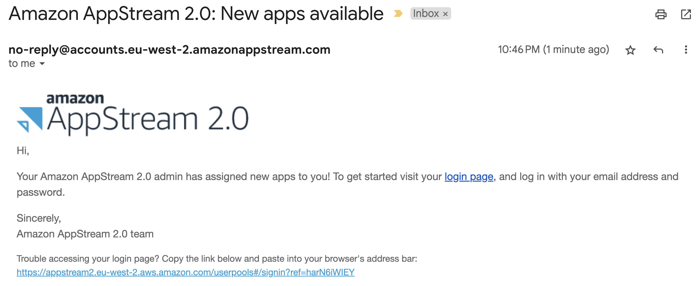
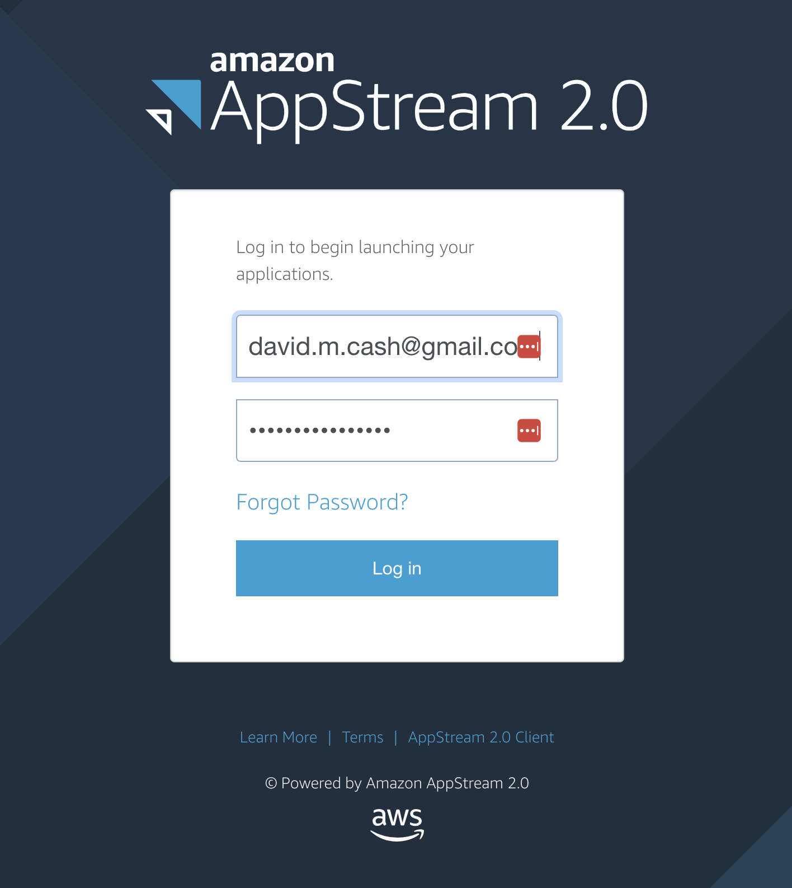
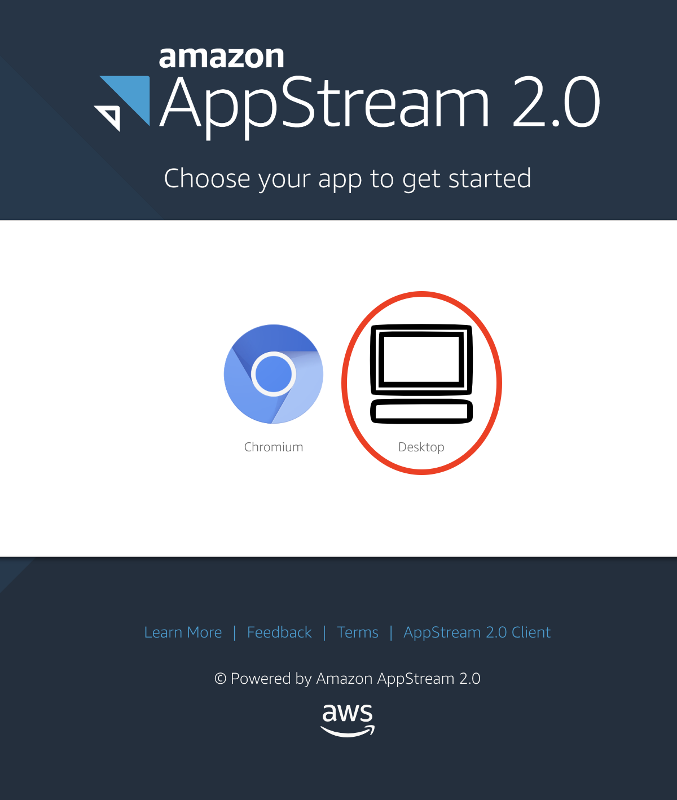

This page will tell you how to access your personal virtual (VM) to run these lessons. The virtual machine is essentially a "computer within a computer". For this workshop, we have created virtual machines that have all the necessary software to perform the lessons. 

### Cloud based instructions
If you have completed the pre-survey questionnaire, then you should have received two emails. These may be located in your spam email:
1. One should be from the email address no-reply@accounts.eu-west-2.amazonappstream.com with the title _Start accessing your apps using Amazon AppStream 2.0_. This will have the link to set your password and log in for the first time. 
1. A second email should come from the same email with the title _Amazon AppStream 2.0: New apps available_. 
 
1. Click on the login link, and you should see the following page.
 
1. Click on the **Desktop** item. It will then launch a computer and you will be able to see the Desktop on the screen
 
1. You will see a status message that it is starting your machine. After that you should see a desktop of the computer you will be doing the lesson with.
 
1. **IF you get an error message** saying "Resources not available, please wait a few minutes, as there will be more virtual machines spinning up to match the demand.

**If you did not supply an email yet, please approach an instructor and we will setup your account**

