# Structural Magnetic Resonance Imaging (MRI)
# Bias Correction, Segmentation and Image Registration

## Introduction
In this section, you will be learning how to process and quantify structural MRI scans. T1-weighted structural MRI scans are the "workhorse" scan of dementia research. They provide high-resolution, detailed pictures of a patient's anatomy, allowing researchers to visualize where atrophy caused by Alzheimer's disease or other dementias is occurring. In addition, it provides anatomical reference to other imaging modalities, such as functional MRI and positron emission tomography (PET), that provide lower-resolution maps of brain function and pathology, so that regional quantification of key areas can be assessed in these scans.

We will be using two widely used software packages: [SPM](https://www.fil.ion.ucl.ac.uk/spm/) and [FSL](https://fsl.fmrib.ox.ac.uk/fsl/fslwiki). These packages provide analysis and visualization functionality of structural and functional neuroimaging data, and they can be used in both cross-sectional and longitudinal studies. The subsequent outputs from these pipelines can be used in the quantification of other imaging modalities. 

After the course, you will be able to perform basic measurements relevant to  dementia research from structural MRI brain scans. 

We will use the SPM and FSL tools to perform:
* image visualization of analysis outputs,
* intensity inhomogeneity correction, 
* structural MRI segmentation,
* quantification of volumetric outputs, and 
* registration to a standard space atlas. 

## Opening up an image
We are going to be working in the `StructuralMRI` subfolder under `data` in your home directory.
From the previous lesson, you should be able to use `fsleyes` to open up the image **NAME** and have a look around.
**TODO: Screenshot of FSLEYES with data
Now open up the other image in the folder: what differences do you notice?

## Run Bias Correction and Tissue Segmentation
SPM simultaneously performs bias correction tissue segmentation: the assignment of probability that a voxel contains key tissue types and 
STEPS:
1. Open up a terminal (screenshots)
1. Type `spm pet` to launch SPM (screenshot)
1. From main menu, select the Segment button (Screenshots). This will launch a window known as the *batch editor*, where you can adjust settings on the pipeline to be run.
1. Edit the options for segmentation:
   1. Under Data->Channels->Volume, click on "Specify...".
   2. In the dialog box that opens up, please navigate to the folder `data` and then `StructuralMRI`. Then select the first image `sub-OAS30003_T1w.nii`. Once you click on it, you will notice the file move down to the bottom of the box which represents the list of selected files.
   3. Click the Done button
   4. Back in the batch editor, under Data->Save Bias Corrected, please choose "Save Field and Corrected"
   5. Under the Tissues section, please make sure that the final three tissue entries have both native and warped tissue set to none.
1. Click the green run button to start! It should take about 5-10 minutes. You will see a lot of other things happening in other windows. The terminal will say `Done - Segment` when it has finished.
 
### Quality check
The quality check is an important pare of any analysis. We are going to open and check out how the bias correction and then the segmentation has worked. 
1. Use `fsleyes` again and open up the original image `sub-OAS30003_T1w.nii` using the `Add image` menu item under File.
2. Change the image lookup table to `NIH` (screenshot) and change the image minimum to 40 and the maximum to 600.
3. Next add the  bias corrected image, which is called  `msub-OAS30003_T1w.niiz.    

Now look at the original image, bias-corrected image (colormaps), and tissue-segmented image

## Obtaining volume
One thing that we are often interested in is to obtain the actual volume of grey matter, or a particular brain region. 
fslstats c1...

## Bias correction
Magnetic resonance images often exhibit image intensity non-uniformities that are the result of magnetic field variations rather than anatomical differences. These variations are often seen as a signal gain change that varies slowly spatially. This can result in white matter voxels in one part of the brain having similar intensities to voxels with the same intensity as grey matter in other parts of the brain. However, the intensities in the white matter voxels should be more or less uniform throughout the brain. Any remaining inhomogeneity in the image can significantly influence the results of automatic segmentations, so we need to correct for these effects. 


## Coregistration to standard space
Running FLIRT to get standard space image

Let’s see this effect in our data. Open the original T1 scan of the CN subject with freeview: 
```shell
freeview -v ~/oasis/all_subjects_BIDS/OAS30015_MR_d2004/anat/sub-OAS30015_ses-d2004_T1w.nii.gz
```
Let’s focus on the axial plane and scroll to superior regions of the brain. With the default gray colorscale, it may be difficult to tell whether the signal intensity actually changes. Let’s change the colormap to “NIH” and set the maximum intensity to 750. 
 
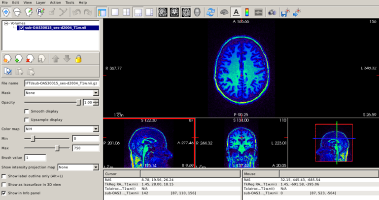
 
Now, the intensity changes are clear, with brighter white matter in posterior brain regions compared to anterior regions. The take-home message is that the grayscale is not the only possible color map for a T1 scan, and sometimes other color maps can be useful.
 
Fortunately, FreeSurfer automatically corrects for  intensity inhomogeneity. The bias-corrected image can be found in the subject’s `mri/` directory (its name is `nu.mgz`), and it is always a good idea to check that FreeSurfer has done a good job correcting for inhomogeneity.
```shell 
freeview -v $SUBJECTS_DIR/CN/mri/nu.mgz 
```
 
Setting the NIH colorscale and the maximum intensity to 270, we can see that the image is now much more uniform: 
 
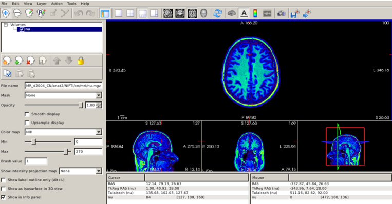
 
## Inspecting cortical segmentation 
After assuring that our T1 scan has been properly corrected for intensity inhomogeneity, the next step is to inspect the results of the FreeSurfer segmentation. As mentioned before, FreeSurfer’s cortical segmentation is based on the reconstruction of surfaces, in particular the surfaces that define the boundary between white matter and gray matter (known as white surface) and the boundary between gray matter and cerebrospinal fluid (known as pial surface). Thus, it is important to make sure that these surfaces accurately follow the gray and white matter boundaries. Let’s check this for our CN subject; remember that all our surfaces are stored in the `surf/` directory.
 
```shell 
freeview -v  $SUBJECTS_DIR/CN/mri/brainmask.mgz -f $SUBJECTS_DIR/CN/surf/lh.white:edgecolor=blue $SUBJECTS_DIR/CN/surf/lh.pial:edgecolor=red $SUBJECTS_DIR/CN/surf/rh.white:edgecolor=blue $SUBJECTS_DIR/CN/surf/rh.pial:edgecolor=red
```
* We open the `brainmask.mgz` volume, which represents the skull-stripped T1 scan.
* `lh.white` and `rh.white` are the left and right white surfaces, respectively.
* `lh.pial`(`rh.pial`) is the left (right) pial surface. 
* After loading each surface, we can use the `:` to indicate that we want to specify additional options that describe what information to display with that surface and how to display it. 
* After each of the pial and white surfaces have been listed, we indicate, using the `edgecolor` option that white surfaces are displayed as blue contours and pial surfaces as red. 
 
To inspect surfaces, we typically navigate through slices in the coronal plane. You can hide or turn off a layer by unchecking the check box next to the layer name.  
 
 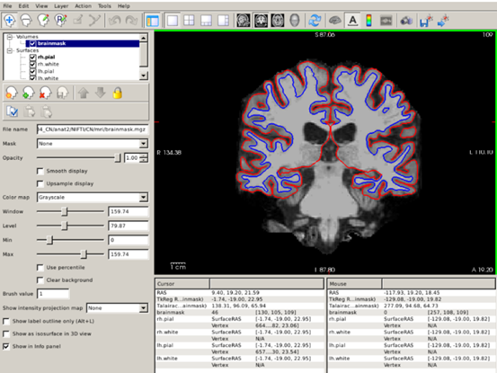

 
We can also visualize 3D renderings of the brain surfaces. This allows us to identify potential segmentation defects and, if the segmentation is correct, to visualize regions with potentially relevant abnormalities. For this, uncheck the `brainmask.mgz` and to visualize the pial (white) surfaces, uncheck the white (pial) surfaces. Select the 3D view (red box below).

 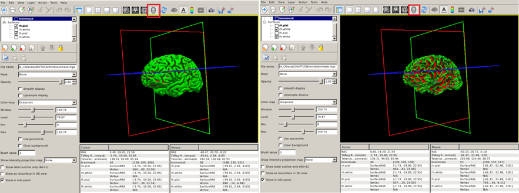

## Inspecting cortical parcellation 
FreeSurfer also *parcellates* the cortex, or divides it up into smalller neuroanatomical units, assigning each surface vertex an anatomical label. There are many different protocols for performing a  parcellation, but the most common in FreeSurfer, particularly for dementia research, is based on the [Desikan-Killiany (DK) atlas](https://surfer.nmr.mgh.harvard.edu/fswiki/CorticalParcellation). This parcellation is stored in the `label/` directory within your subject’s directory. The Freeview command to visualize the DK parcellation on top of the cortical surface is the following: 
 
```shell 
freeview -f $SUBJECTS_DIR/CN/surf/lh.pial:annot=aparc.annot $SUBJECTS_DIR/CN/surf/rh.pial:annot=aparc.annot --viewport 3d
```
* The `annot` option for a surface tells FreeSurfer to paint colours on the pial surface based on what label the parcellation has provided. 
* The `--viewport 3d` option is simply to automatically set the 3D rendering view that you saw in the previous visualisation.
 
 You can check the name of the region by clicking on it (red box below). 

 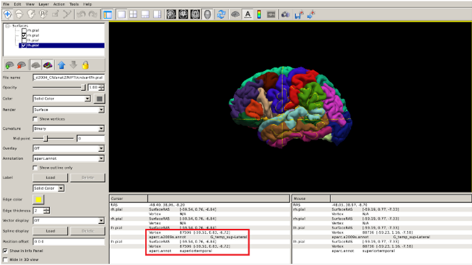

### Exercise 3
*Repeat the previous steps to visualize the cortical parcellation of the FTD subject.*  
 
 Labels are not the only thing we can overlay on the cortical surface. For further surface based visualization, please see the [Stretch Your Knowledge](#stretch-your-knowledge) section.

## Volumetric segmentation
Now, we will go over the main volumetric segmentation output from  FreeSurfer, often referred to as the *aparc+aseg* segmentation. This segmentation contains cortical and subcortical regions of interest. The DK atlas based *aparc+aseg* is commonly used in dementia research, for example in the quantification of tau and amyloid PET scans (Jack et al. Alzheimers Dement. 2017; Mormino et al. Brain. 2009). 

Let’s visualize these segmentations with Freeview. Segmentations are 3D images, where the voxel value represents which anatomical label is assigned. Loading these volumes on top of the T1 can be done in Freeview with the following:

```shell
freeview -v $SUBJECTS_DIR/CN/mri/brainmask.mgz $SUBJECTS_DIR/CN/mri/aparc+aseg.mgz:colormap=lut:opacity=0.2 
```
* Just like with surfaces, we can provide additional information on how to display the volumes by adding a `:` after the filename.
* We select the Look Up Table, or `lut`, colormap which sets a different color for each value in the volume (thus it’s useful for visualizing segmentations). 
* We set the `opacity` option to 0.2 to simultaneously visualize the skull-stripped T1 scan. 

By clicking on the different regions of interest we can get the region name (red box below): 

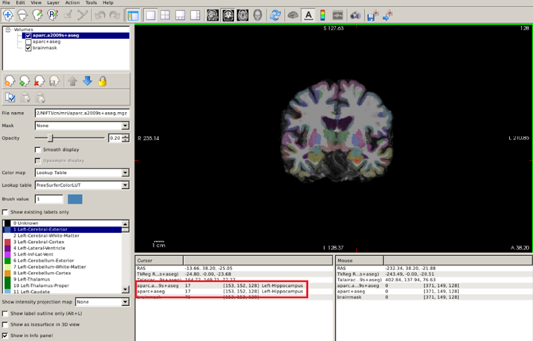

## Obtaining quantitative morphometric and volumetric measures
Key measurements that can be extracted from a T1 scan in the context of dementia are  quantitative metrics that describe the degree of atrophy in a specific brain region. These metrics can be the volume of the region of interest (e.g. the volume of the left hippocampus or the volume of the entorhinal cortex) or the average thickness of a cortical structure (e.g the precuneus). Though volumetric and thickness measures describe essentially the same pathological process, thickness metrics may be more sensitive for describing atrophy in the cortex. 

Let’s see how to obtain a complete morphometric or volumetric set of measures of the regions of interest in the Desikan-Killiany atlas.  Let’s obtain thickness measures in CSV format for our subjects using `aparcstats2table`. Type:

```shell
# First make a directory for the output, 
# the -p option just makes any additional folders necessary to make this one
mkdir -p ~/data/structural_mri_output
aparcstats2table --subjects CN AD FTD --hemi lh --meas   thickness --parc=aparc --tablefile ~/data/structural_mri_output/lh_thickness.csv
```

In this command, 
* We select the subjects included in the analysis with the `subjects` flag.
* The `hemi` flag  is to select the left (`lh`) or right (`rh`) hemisphere.
* The `meas` flag selects the type of measure displayed, in this case thickness, but it could volume or area as well.
* The `parc` option is to select the atlas (Desikan-Killiany [`aparc`]).
* The `tablefile` option specifies the path and name of the CSV file with the results. This CSV file can be later opened with your favorite stats software. 

Now, you may have noticed that the previously generated CSV files don’t contain information about subcortical structures (such as the putamen). This is because this information is contained in the *aseg* part of the segmentation, which is not based on the cortical surfaces. We can get these measures with the `asegstats2table` command. Type:

```shell
asegstats2table --subjects CN AD FTD --meas volume --stats=aseg.stats --tablefile ~/data/structural_mri_output/volumes.csv  
```

* Again, we select the subjects included in the analysis with the `subjects` flag.
* The `meas` flag selects the type of measure displayed, in this case volume, but it could be the mean or standard deviation intensity in the respective region.
* The `stats` option points towards the type FreeSurfer stats file, in this case `aseg.stats`.  

## Coregistration
When a subject undergoes multimodal imaging studies in different scanners, the head is typically differently oriented within the field of view. Thus, the images appear rotated and displaced relative to the MR images and it’s difficult to co-localize regions visible in PET precisely on a corresponding MR section. 

Let’s see this in our data. In the path `~/oasis/OAS30015_PIB_d2144/static_PET.nii.gz`, you will find a PET scan (an amyloid PET scan with the PiB tracer) acquired for our CN subject. Let’s load the PET and corresponding original MRI simultaneously: 

```shell
freeview -v ~/oasis/all_subjects_BIDS/OAS30015_MR_d2004/anat/sub-OAS30015_ses-d2004_T1w.nii.gz ~/oasis/OAS30015_PIB_d2144/static_PET.nii.gz
```

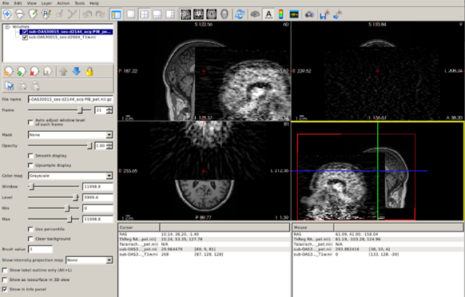

Now you can clearly see how the images are completely misaligned, making it impossible to use the rich anatomical information contained in the T1 scan to quantify the PET scan. 

Fortunately, we have automatic tools that will find the set of rotations and translations necessary to align the PET with the T1 scan. This process is known as *coregistration* and it is essential for combining information from both image modalities. Let’s see how to do this with our data for a simple PET to T1 coregistration. There are different approaches implemented in FreeSurfer that we can use for coregistering a PET image to a T1 scan, but for the sake of conciseness we are going to focus on the `mri_coreg` function which in general does a good job. To estimate the set of rotations and translations needed for aligning the PET to the T1 scan just type:

```shell
mri_coreg --s CN --mov ~/oasis/OAS30015_PIB_d2144/static_PET.nii.gz --reg ~/data/structural_mri_output/pet.reg.lta
```

As usual, the flag `--s` points to the specific subject we are working with (in this case, the CN subject); the flag `--mov` points to the path of the static PET image we want to coregister to the T1 scan; the flag `--reg` indicates the path in which the file containing the information regarding the rotations and translations will be stored (`~/data/structural_mri_output/pet.reg.lta`, and we name the file as `pet.reg.lta`).

Once the pipeline has run the coregistration process, we need to inspect that indeed both images are correctly aligned. For this, we can use Freeview and the image-specific option reg. Type: 

```shell
freeview -v $SUBJECTS_DIR/CN/mri/brainmask.mgz ~/oasis/OAS30015_PIB_d2144/static_PET.nii.gz:colormap=NIH:reg=~/data/structural_mri_output/pet.reg.lta  -f $SUBJECTS_DIR/CN/surf/lh.white:edgecolor=blue $SUBJECTS_DIR/CN/surf/lh.pial:edgecolor=red $SUBJECTS_DIR/CN/surf/rh.white:edgecolor=blue $SUBJECTS_DIR/CN/surf/rh.pial:edgecolor=red
```

Amyloid PET images show non-displaceable binding (binding to something that is not amyloid plaques) in the white matter and brainstem. We can use this fact to check for correct coregistration. A useful strategy is to set the sagittal plane and visualize the brainstem and the corpus callosum, changing the opacity of the PET image to check that these regions with elevated signal do overlap: 
 
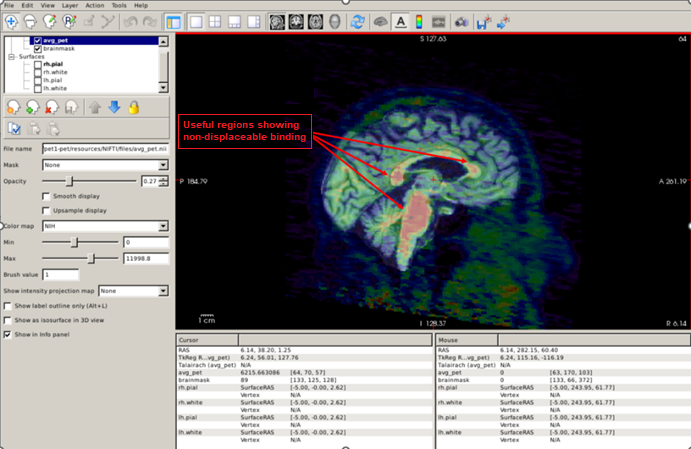

Another useful quality-control analysis is to set the pial and white surfaces in the coronal plane and check that the signal is elevated within the white matter boundary. Also, note the low uptake in the grey matter compared to the white matter, which suggests that this is an amyloid-negative individual. 

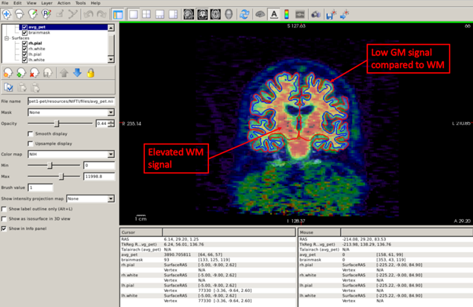
 
Now that we checked that the coregistration is ok, we can run the commands to actually quantify our static PET scan. You can find these in the [Stretch Your Knowledge](#stretch-your-knowledge) section. 

## Further reading
Freesurfer has a detailed wiki with multiple tutorials. 

## Stretch your knowledge
### Visualizing cortical thickness maps

Labels are not the only thing we can overlay on the cortical surface. A very useful way to detect cortical atrophy with a single snapshot is to visualize cortical thickness maps of the brain. FreeSurfer provides regional, high spatial resolution measures of cortical thickness throughout the brain, allowing us to quantify regional atrophy across the brain when we don’t have any pre-specified hypothesis about the regions involved.
 
For better visualization of cortical thickness maps, particularly in the cortical sulci, we will use a surface known as the inflated surface. This surface essentially removes the folds by performing an inflation (similar to blowing up a beach ball) on the white surface, so that visualization on the sulci is easier: 

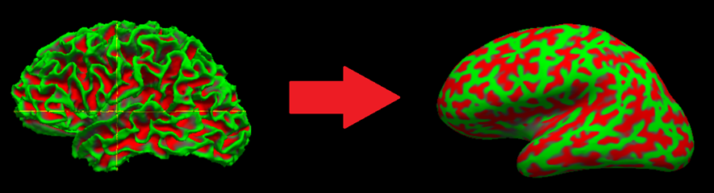

Let’s see this in our CN subject. Let’s load both the white and inflated surfaces. Type: 

```shell
freeview -f $SUBJECTS_DIR/CN/surf/lh.inflated $SUBJECTS_DIR/CN/surf/lh.white $SUBJECTS_DIR/CN/surf/rh.inflated $SUBJECTS_DIR/CN/surf/rh.white --viewport 3d
```
 
As you probably have guessed, `lh(rh).inflated` is the left (right) inflated surface. By default, Freeview represents sulci as red regions (based on a geometric property known as curvature) and gyri as green regions.

Now let’s visualize the cortical thickness map of our CN participant using the overlay option. Type:

```shell
freeview -f $SUBJECTS_DIR/CN/surf/lh.inflated:overlay=$SUBJECTS_DIR/CN/surf/lh.thickness:overlay_color=colorwheel,inverse:overlay_threshold=0.6,1.5 $SUBJECTS_DIR/CN/surf/rh.inflated:overlay=$SUBJECTS_DIR/CN/surf/rh.thickness:overlay_color=colorwheel,inverse:overlay_threshold=0.6,1.5 -colorscale --viewport 3d
```

Let's break down this command a bit more:
* As mentioned earlier, the `-f` option indicates which surface we want, in this case the left and right inflated surfaces.
* We can specify multiple options to each surface by starting each one with a `:`. As you can see, this starts right after we have listed the name.
* We use the `overlay` option to 
point to the left (right) cortical thickness map `lh(rh).thickness`.
* We tell Freeview how to map colors to ranges of thickness values with the `overlay_color` option; here, we selected the inverted colorwheel scale (`colorwheel, inverse`).
* Finally, we select the upper and lower limits of thickness values that this color map will represent with the `overlay_threshold` option; we select 0.6 mm as the lower and 1.5 mm as the maximum limit. All values below the minimum will use the minimum color and all thickness values greater than this maximum threshold will just have the maximum color. The `colorscale` flag will display the colorbar used. 

If you want to measure cortical thickness in a particular region (vertex) you just have to click on the region you are interested in and check the number in the red box below (2.77 mm): 
 
 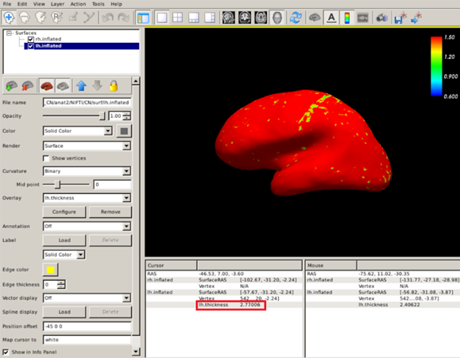

### Exercise 4
*Repeat the previous steps to visualize the cortical thickness maps of the AD and FTD patients with that of the CN subject. Use the inverted colorwheel as the colorscale and set colorscale lower and upper limits to 0.6 mm and 1.5 mm, respectively. Can you see clear differences among these subjects? What can the atrophy pattern tell us about the FTD patient?*  

### Extracting quantitative PET metrics
To perform PET quantification, FreeSurfer requires the generation of a high-resolution segmentation called `gtmseg.mgz`. `gtmseg.mgz` will use `aseg.mgz` for subcortical structures, `?h.aparc.annot` for cortical structures, and will estimate some extra-cerebral structures. To create `gtmseg.mgz`, we’d just need to run the following command (**DON’T RUN THIS COMMAND, gtmseg TAKES 1-2 HOURS. WE’VE RUN gtmseg ALREADY FOR YOU**): 

```shell
gtmseg --s CN 
```

This will create a file called `$SUBJECTS_DIR/CN/mri/gtmseg.mgz`, which is the anatomical 3D segmentation we are going to use to quantify our PET scan. 

Now we just need to use the function `mri_gtmpvc` to get a table with the average signal values for each region of interest contained in `gtmseg.mgz`. Type: 

```shell
mri_gtmpvc --i ~/oasis/OAS30015_PIB_d2144/static_PET.nii.gz --reg   ~/data/structural_mri_output/pet.reg.lta --seg   $SUBJECTS_DIR/CN/mri/gtmseg.mgz --auto-mask 1.01 --no-tfe --no-rescale --o ~/data/structural_mri_output/gtmpvc.output
```

* As usual, the `--i` flag points to our static PET image we want to quantify.
* The `--reg` points to the path of the registration file we obtained in the coregistration process.
* The `--seg` flag points to the newly generated, high-resolution segmentation `gtmseg.mgz`.
* The `--auto-mask` flag is to create a mask so that irrelevant voxels outside of the head are not analyzed (this is necessary only if we apply partial volume correction, but we need to specify it anyway); "1.01" will roughly extend the mask about 1mm beyond the head. 
* The `--no-tfe` flag disables the tissue fraction effect correction, which is a type of partial volume effect. 
* The `--no-rescale` flag indicates that we will get the raw PET values, without any rescaling. 
* Finally, the `--o` flag specifies the path in which the output of this quantification pipeline will be stored.

After running this, you will get an easy-to-read file called `gtm.stats.dat` containing the results of the quantification. The data has the following structure (here I used MATLAB and the function “readtable”)

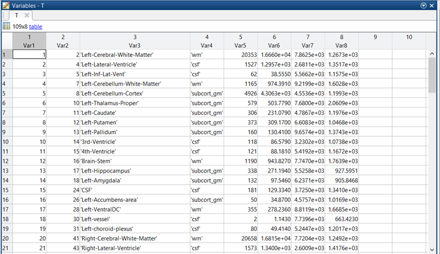
 
- Var 1 (first column) is irrelevant. It is just the number of the row. 
- Var2 is the index of the ROI in the gtmseg.mgz segmentation. 
- Var 3 is the name of the ROI. 
-	Var 4 is the tissue class (grey matter, white matter, csf, etc.)
-	Var 5 is the number of PET voxels in the ROI. This is important for computing weighted averages.
-	Var 6 and Var 8 are variance estimates that are not particularly interesting for us. 
-	Var 7 is the actual PET signal, this is the quantity we are interested in.  
