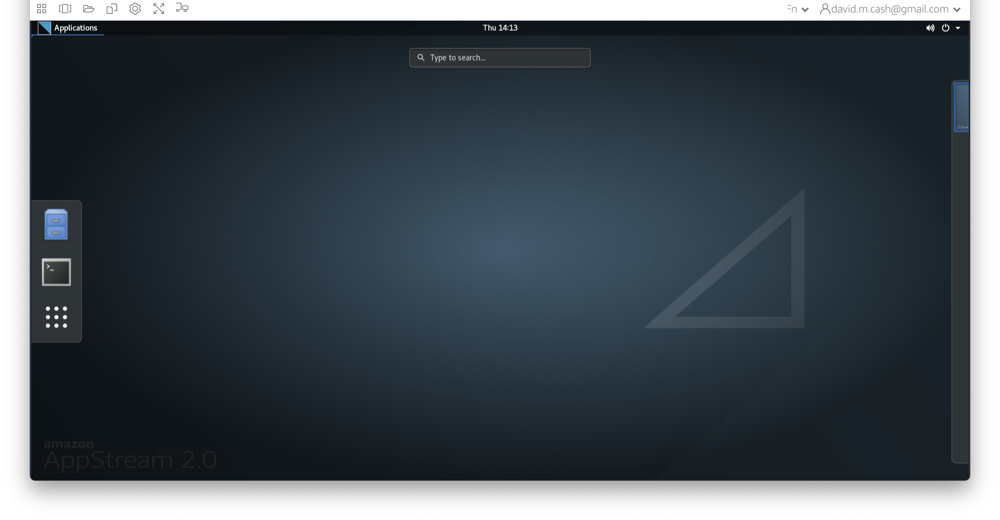
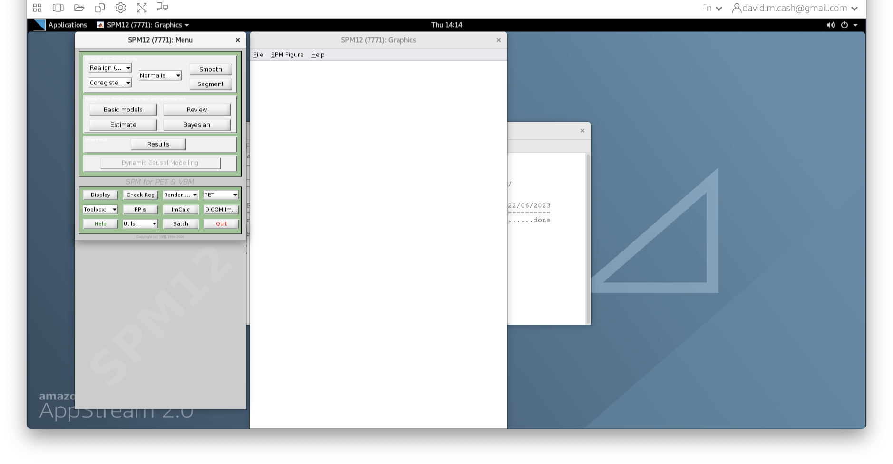
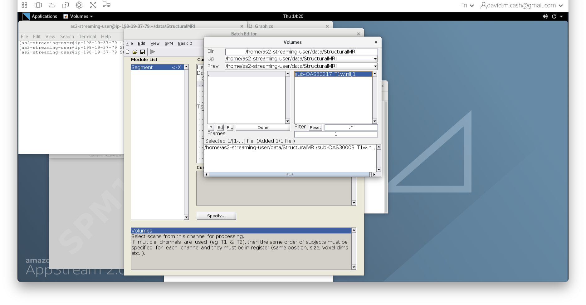
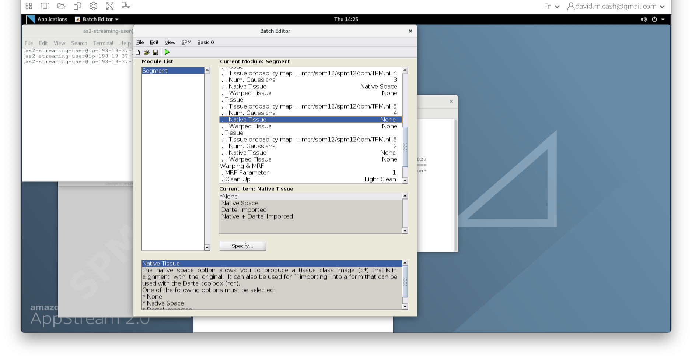
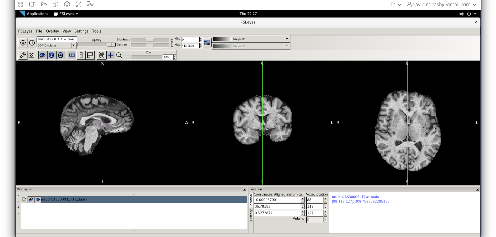
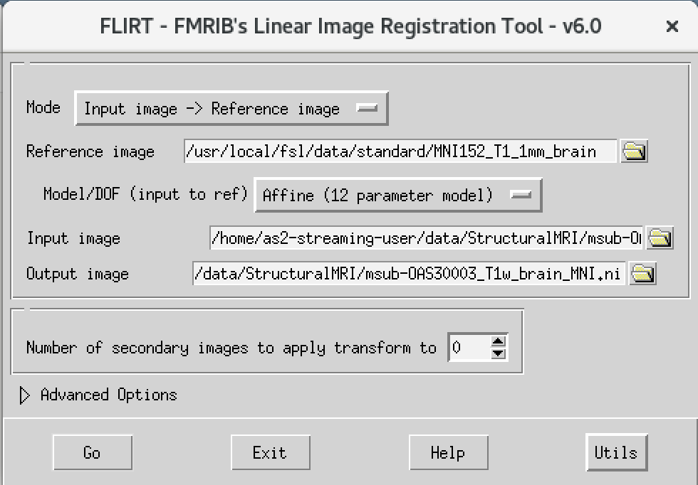
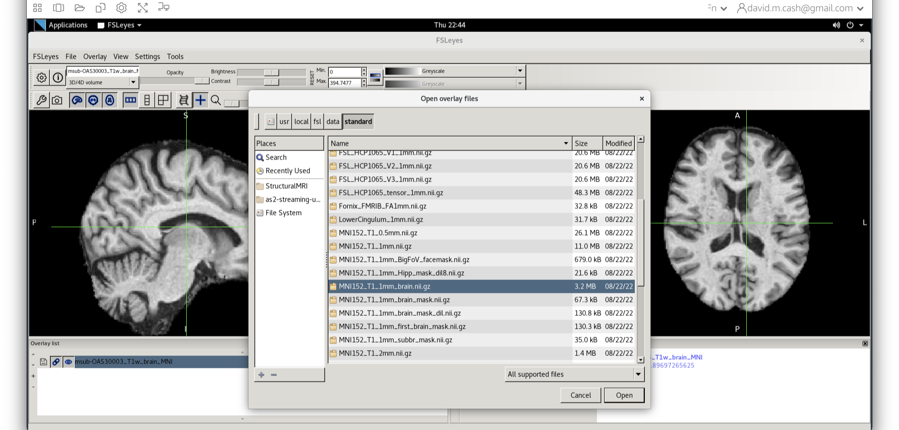

# Structural Magnetic Resonance Imaging (MRI)
# Bias Correction, Segmentation and Image Registration

## Introduction
In this section, you will be learning how to process and quantify structural MRI scans. T1-weighted structural MRI scans are the "workhorse" scan of dementia research. They provide high-resolution, detailed pictures of a patient's anatomy, allowing researchers to visualize where atrophy caused by Alzheimer's disease or other dementias is occurring. In addition, it provides anatomical reference to other imaging modalities, such as functional MRI and positron emission tomography (PET), that provide lower-resolution maps of brain function and pathology, so that regional quantification of key areas can be assessed in these scans.

We will be using two widely used software packages: [SPM](https://www.fil.ion.ucl.ac.uk/spm/) and [FSL](https://fsl.fmrib.ox.ac.uk/fsl/fslwiki). These packages provide analysis and visualization functionality of structural and functional neuroimaging data, and they can be used in both cross-sectional and longitudinal studies. The subsequent outputs from these pipelines can be used in the quantification of other imaging modalities. 

After the course, you will be able to perform basic measurements relevant to  dementia research from structural MRI brain scans. 

We will use the SPM and FSL tools to perform:
* image visualization of analysis outputs,
* intensity inhomogeneity correction, 
* structural MRI segmentation,
* quantification of volumetric outputs, and 
* registration to a standard space atlas. 

## Opening up an image
We are going to be working in the `StructuralMRI` subfolder under `data` in your home directory.From the previous lesson, you learned how to view and navigate images.

Clicking on the Applications in the upper left-hand corner and select the terminal icon. This will open a terminal window that you will use to type commands
  
 
From the terminal window, type `fsleyes` to open up the image and have a look around.


Now we choose the file `sub-OAS_30003_T1w.nii` by going to the File menu and choosing the Add Image command


### Exercise 1
Close fsleyes and then re-open the viewer. This time use the other image in the folder `sub-OAS30217_T1w.nii`. 

*What differences do you notice?*

## Run Bias Correction and Tissue Segmentation

Small variations in the magnetic field can result in changes in the image intensity  that vary slowly spatially. These variations are not due to anatomical differences. We can visually identify this *image inhomogeneity* in the white matter, where voxels in one part of the brain might be so affected by it that they have similar intensity values as grey matter voxels in other brain regions. However, the intensities in the white matter voxels should be more or less uniform throughout the brain. Any remaining inhomogeneity in the image can significantly influence the results of automated image processing techniques, so we need to correct for these effects. The process that removes this image inhomogeneity is typically referred to as *bias correction*. 

The next step is to reliably identify what type of tissue each voxel contains. While the resolution of structural MRI is quite high (typically around 1 mm), there is still the likelihood that a voxel will contain more than one tissue in it. The process of *tissue segmentation* looks at the voxel intensity, compares it to its neighbours and prior information about what tissues we would expect to have in that voxel and assigns a probability that the voxel contains that tissue. It typically generates *n* different volumes, where *n* is the number of tissue types you want to use to classify the brain. We typically focus on three tissue probability maps in particular:
* Grey matter (GM), 
* White matter (WM), and
* Cerebrospinal fluid (CSF)

SPM performs the *bias correction* and *tissue segmentation* steps simultaneously. Follow the steps below to obtain bias-corrected images and tissue probability maps. 

STEPS:
1. Type `spm pet` to launch SPM (screenshot)
 
1. SPM will then create a number of windows. You want to look at the Main Menu Window that has ll of the buttons.
 
1. From main menu, select the Segment button (Screenshots). This will launch a window known as the *batch editor*, where you can adjust settings on the pipeline to be run.
  
1. Edit the options for segmentation:
   1. Under Data->Channels->Volume, click on "Specify...".
    
   1. In the dialog box that opens up, please navigate to the folder `data` and then `StructuralMRI`. Then select the first image `sub-OAS30003_T1w.nii`. Once you click on it, you will notice the file move down to the bottom of the box which represents the list of selected files.
    
   1. Click the Done button
   1. Back in the batch editor, under Data->Save Bias Corrected, please choose "Save Field and Corrected"
    
   1. Under the Tissues section, please make sure that the first three tissue types, which represent GM, WM, and CSF, have the native tissue subfield set to native, while the final three tissue types (4-6), which represent non-brain structures, have the native tissue subfield set to None.
    
1. Click the green run button to start! It should take about 5-10 minutes. You will see a lot of other things happening in other windows. The terminal will say `Done - Segment` when it has finished.
 
## Quality check
The quality check is an important part of any analysis. We are going to visualize the outputs from SPM Segment and make sure that the bias correction and segmentation have worked. 

### Bias correction
1. Use `fsleyes` again and open up the original image `sub-OAS30003_T1w.nii` as you did at the start of the session.
2. Change the image lookup table to `NIH` (screenshot)
 
3. Then change the image minimum to 40 and the maximum to 600. This means that all intensities 40 and below will map to the first color in the lookup table, and all voxels 600 and above will map to the last color. The white matter should be yellow to red.
    
4. Next add the  bias corrected image, which is called `msub-OAS30003_T1w.nii`. Change the lookup table to NIH as you did in Step 2. Change the minimum to 40 and maximum intensity to 500 similar to what you did in Step 2 and 3. 
    

 When you add this image, it will overlay on top of the original image. Think of this new image a completely opaque, so that you no longer see the original one. If you want to see the original one, then you need to either turn it off using the eye icon right by the file, or you need to turn the opacity (slider near the top of the screen which is marked opacity.)

### Exercise 2
Use the eye icon in the overlay list right next to the file `msub-OAS30003_T1w.nii` and turn this image off and on many times. This will allow you to compare with the original image. 

*What do you notice about the image in the white matter area when comparing the bias correct and original image?*

### Tissue segmentation
Now that we are happy with the bias correction, lets look at the tissue segmentation.
1. Use the icon to turn off the original image. Select the bias corrected image and make sure the colormap is back to the first option "Greyscale"
 
1. Now add the grey matter probability image `c1sub-OAS30003_T1w.nii`. 
1. Choose the probability map and set the lookup table to Red. Change the minimum intensity to 0.2 and the maximum intensity to 0.9. This will eliminate some noise from very low probability voxels.
1. Use the opacity slider to make the grey matter probability map transparent.
 
1. Look around the image, zoom in places, and try turning the grey matter probability map off and on. The goal is to make sure the grey matter probability map is not:
   1. Missing any grey matter
   1. Not including other tissue (WM, CSF, non-brain tissue that has a similar intensity to GM)

### Exercise 3
Now do the same steps with the white matter image `c1sub-OAS30003_T1w.nii` and the cerebrospinal fluid image `c3sub-OAS30003_T1w.nii`. Choose different color colormaps. 

*Do these images look like they have identified the white matter and CSF in the T1 weighted image correctly?*


## Obtaining volume
One thing that we are often interested in is to obtain the actual volume of grey matter, or a particular brain region. There are helpful utilities in FSL to extract the volume from the tissue probability maps. This will give you total grey matter volume:
```bash
fslstats c1sub-OAS30003_T1w.nii -V
```

### Exercise 4
Run the same command for the WM and CSF images

*What are the three tissue volumes?*

## Coregistration to standard space
MRI scans can be acquired in any orientation. Even when we think we are getting a sagittal or coronal acquisition, the patient may end up in the scanner at a slant. This makes it difficult to identify key anatomical landmarks. We may also want to compare common anatomical structures across a whole sample of subjects. The main solution to this is to use *image registration* to orient our images and align them with a standard anatomical coordinate system. In this case, we will be aligning our data to the Montreal Neurological Institute [MNI152 atlas](https://mcin.ca/research/neuroimaging-methods/atlases/). We are not looking to perform an exact voxel to voxel match between our image and the atlas. Instead, we just want to align the images such that the orientation and the relative size are aligned.

### Skull stripping
Before we can perform the registration, we will use the tissue probability maps to *skull strip* the image. Skull stripping removes the non-brain tissue (scalp, dura, neck, eyes, etc) from the image. First we will use the FSL utility `fslmaths` to create a brain mask by using the tissue probability maps from SPM. Fslmaths is a great swiss-army knife utility to do lots of helpful little image processing bits. 

```bash
fslmaths c1sub-OAS30003_T1w.nii -add c2sub-OAS30003_T1w.nii -add c3sub-OAS30003_T1w.nii -thr 0.5 -bin sub-OAS30003_T1w_brain_mask.nii
```

Let's break this command down a little bit:
* First, we state the command we want to run `fslmaths`
* We then specify our input image, the GM map `c1sub-OAS30003_T1w.nii`
* We then specify the first operation `-add`
* We then specify what we want to add to our input image. In this case, it is the WM map `c2sub-OAS30003_T1w.nii`. The resulting image would contain the probability that a voxel is either GM or WM.
* We then specify that we want to add another image, and this time it is the CSF map. This image now holds the probability that a voxel is GM, WM, or CSF, which are the three main tissue types in the brain that we want to process.
*  We will then threshold this image at 0.5 using the `-thr 0.5` option. This says to only keep voxels who have a probability of 0.5 or greater. All other voxels are set to 0. 
* Our final operation is to *binarize* the image. Any values that are not zero are set to one. This creates a mask which says whether the voxel is inside (**1**) or outside (**0**) of the brain.  
* Finally, we save our results into the new image file `sub-OAS30003_T1w_brain_mask.nii`

Now that we have created a mask, we are going to remove all the information outside of the mask using the following command:
```bash
fslmaths msub-OAS30003_T1w.nii -mas sub-OAS30003_T1w_brain_mask.nii.gz msub-OAS30003_T1w_brain.nii
```
This command masks our bias corrected image with the brain mask and makes a new file which has the name `msub-OAS30003_T1w_brain.nii`. Take a look at the image in `fsleyes`.


We will then use the FSL registration program [FLIRT](https://fsl.fmrib.ox.ac.uk/fsl/fslwiki/FLIRT) to align our image to the standard space MNI152. Please follow the steps below:
1. On the terminal window, please type in the following command `Flirt`
1. This will open a dialog box. We will change the following settings:
   1. For reference image, click on the folder icon and choose the image `MNI152_T1_1mm_brain`
   1. For the input image, please select the mask we created above `msub-OAS30003_T1w_brain.nii`
   1. For the output image, please type in a new name `msub-OAS30003_T1w_brain_MNI.nii`
The final command setup should look like the screenshot below.


If your window looks like this, then click the **go** button at the bottom, in the terminal, you will see the *command line* program that would run what you have set up in the dialog box. If you were to select that command and run it in the terminal it would do the same thing. 

### Quality check
Let's open `fsleyes` and open the output from the co-registration `msub-OAS30003_T1w_brain_MNI.nii`.


Now click on the Add Standard function. This is where fsleyes keeps all of the standard atlases and templates so that you can quickly access them.


Select the `MNI152_T1_1mm_brain` from this list of files.


We can now check if our image is registered by flicking back and forth between the MNI image and our image. 

### BONUS Exercise 5
Let's take a look at our other image `sub-OAS30217_T1w.nii`. Run the same skull stripping and registration as you have done before. Now open up both standard space images in `fsleyes`

*What do you observe about the images?*

## Next Steps
You have completed the structural MRI section. Now you can explore different imaging modalities or do some additional work on structural data!
